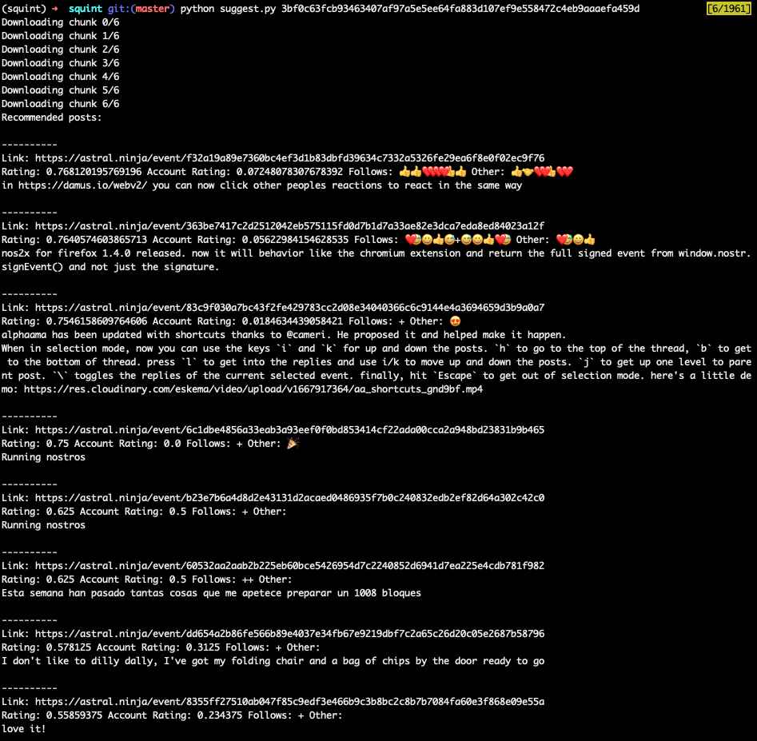

This is a proof of concept showing what it might look like for nostr relays or clients to supply suggestions to users based on reactions and account reputation, weighted to prefer first and second-order follows.

To generate content suggestions for a given user account, run `python suggestion.py <pubkey>`.

Here's an example:

